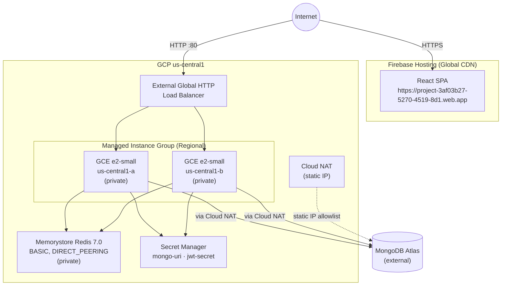

# Much-To-Do — GCP Infrastructure

Terraform infrastructure for the Much-To-Do full-stack application on Google Cloud Platform.

## Architecture



**Networking:** Custom VPC · Private subnet 10.0.0.0/24 · Static NAT IP (for MongoDB Atlas allow-list) · No external IPs on VMs · IAP-only SSH

## Module Structure

| Module | Purpose |
|:---|:---|
| `vpc` | VPC, subnet, static NAT IP, Cloud Router, Cloud NAT |
| `firewall` | Least-privilege rules (LB/HC CIDRs only, IAP SSH, Redis internal) |
| `iam` | Three service accounts + Workload Identity Federation for GitHub Actions |
| `secrets` | Secret Manager for MongoDB URI and JWT secret with per-secret IAM |
| `memorystore` | Managed Redis 7.0 BASIC 1GB DIRECT_PEERING |
| `logging` | Cloud Logging bucket, 30-day retention, Ops Agent on VMs |
| `compute` | Regional MIG with instance template, rolling updates, auto-healing |
| `load_balancer` | External Global HTTP LB → backend service → MIG |

## Quick Start

```bash
# 1. Create Terraform state bucket (one-time)
chmod +x scripts/bootstrap-tfstate.sh
./scripts/bootstrap-tfstate.sh project-3af03b27-5270-4519-8d1

# 2. Initialize Terraform
terraform init

# 3. Configure secrets
cp prod.tfvars.example prod.tfvars
# Fill in mongo_uri and jwt_secret_key

# 4. Deploy
terraform apply -var-file=prod.tfvars

# 5. Read post-deploy checklist
terraform output post_deploy_instructions
```

## Service Accounts

| Account | Role | Purpose |
|:---|:---|:---|
| `much-to-do-backend-prod` | secretmanager.secretAccessor, logging.logWriter, monitoring.metricWriter | Runtime SA for GCE VMs |
| `much-to-do-deployer` | compute.instanceAdmin.v1, iap.tunnelResourceAccessor, firebase.admin | GitHub Actions CI/CD (WIF, keyless) |
| `muchtodo-dev-view` | viewer, logging.viewer, monitoring.viewer, compute.viewer | Grader read-only access |

## Security

- No external IPs on VMs — SSH via IAP tunnel only
- No JSON SA keys output from Terraform — grader key is a manual post-deploy step
- Secrets in Secret Manager — never in committed `.tf` or `.tfvars` files
- GitHub Actions uses Workload Identity Federation (no long-lived credentials)
- Firewall: backend port open **only** to GCP LB CIDR ranges (no 0.0.0.0/0)
- `prod.tfvars` is in `.gitignore`

## Grader Access

After deployment:

```bash
gcloud iam service-accounts keys create grader-key.json \
  --iam-account=$(terraform output -raw grader_service_account) \
  --project=project-3af03b27-5270-4519-8d1

gcloud auth activate-service-account --key-file=grader-key.json
```

## Destroy

```bash
terraform destroy -var-file=prod.tfvars
# Then delete state bucket manually if no longer needed:
# gcloud storage buckets delete gs://much-to-do-tfstate-gcs
```
